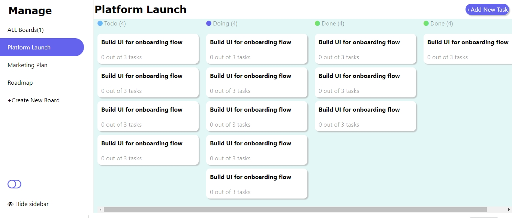
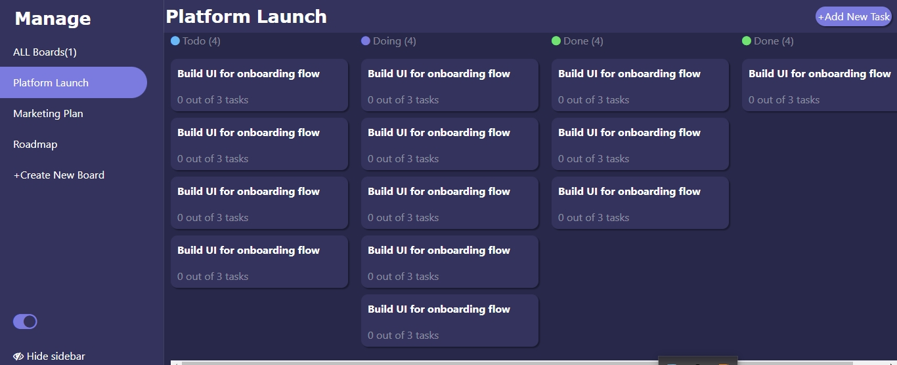

# Manage  

  
## Description  
Manage is a full stack web application built to manage all kinds of projects. This application takes in user input for creating boards tasks and subtasks and saves them for future retrieval, a good feature for managing projects. The technologies, frameworks and languages used are, html, css, bootstrap, javascript ES6+, python, flask, mysql. It also has user authentication as such, users would have to create an account to use it. Find the deployed frontend application [here](https://brian-machiestay.github.io/Manage/)

## Table of Content  

- [Description](#description)
- [Installation](#installation)
- [Screenshots](#screenshots)
- [Project Demo](#Demo)
- [Usage](#usage)
- [License](#license)
- [Contributing](#contributing)
- [Tests](#tests)
- [Questions](#questions)  
  
## Installation    
 The website does not require installation
 
## Screenshots  
   
 
 
##  Demo  
    
## Usage  
  This application can be used and modified by anyone  
## License  

This software uses The MIT License  
## Contributing  
 - `git clone` this repository  
 - create a `pull request`  
## Tests  
No tests written yet for this project
## Questions  
Have any questions?  
Email: Brianmachiestay@gmail.com  
[Github](https://github.com/Brian-Machiestay/)  
